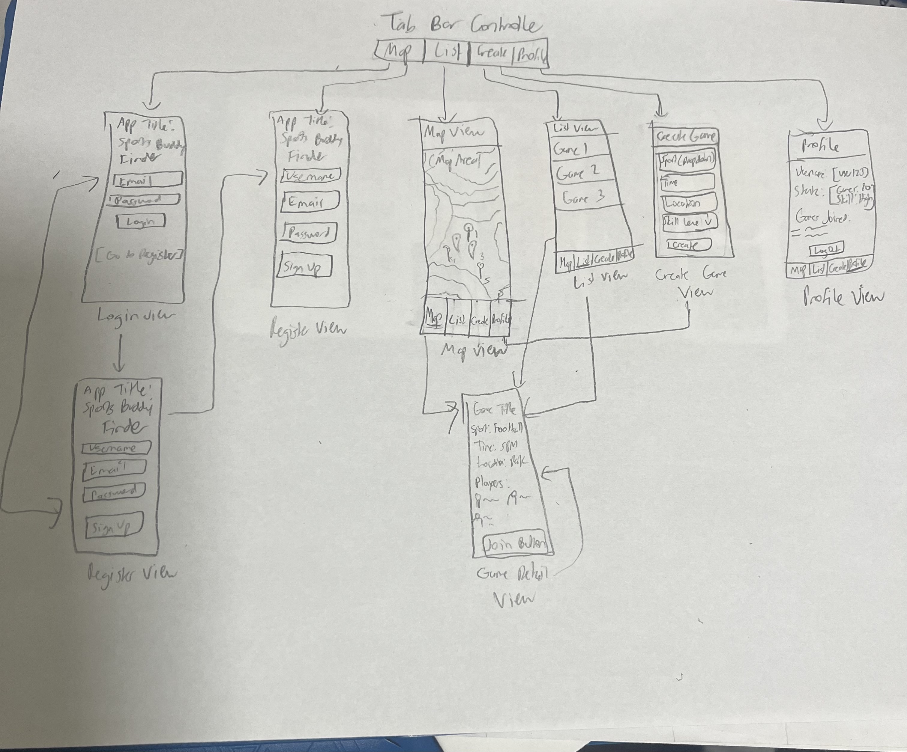

# final_project_cst380

## Table of Contents

1. [Overview](#Overview)
2. [Product Spec](#Product-Spec)
3. [Wireframes](#Wireframes)
4. [Schema](#Schema)

## Overview

### Description

Sports Buddy Finder is a social networking app designed to bridge the gap between solo athletes and local pickup games. Whether you're looking for people for a soccer match or a full squad for a basketball run, this app allows users to find, host, and join local sporting events in real-time based on location and skill level.

### App Evaluation

- **Category:** Social / Fitness
- **Mobile:** Mobile is essential for real-time GPS location tracking to find nearby games and for push notifications to alert users of upcoming game starts or new joins.
- **Story:** the common "empty court" problem by connecting people who want to stay active but lack a consistent group of players.
- **Market:** Large and diverse, ranging from college students looking for intramural games to adults seeking weekend recreational sports.
- **Habit:** High frequency; users engage whenever they feel like exercising or checking for game availability in their area.
- **Scope:** Clearly defined. The MVP focuses on game discovery and creation, while later versions can expand into in-app messaging and skill-based matchmaking.

## Product Spec

### 1. User Stories (Required and Optional)

**Required Must-have Stories**

- [X] User can register a new account and log in.
- [X] User can view a Map/List of nearby pickup games.
- [ ] User can create a new game lobby (specifying sport, time, location, and difficulty).
- [ ] User can "Join" a game lobby to notify the host.
- [ ] User can view their profile and a list of games they are attending.

**Optional Nice-to-have Stories**

- [ ] User can chat with other participants in a specific game lobby.
- [ ] User can rate other players' skill levels or sportsmanship.
- [ ] User receives a push notification 30 minutes before a game starts.

### 2. Screen Archetypes

- [X] Login / Register Screen
- [X] User can sign up or log in to their account.
- [X] Map View (Home)
- [ ] User can see pins of nearby games and filter by sport.
- [ ] Stream/List View
- [X] User can scroll through a list of upcoming games sorted by time or proximity.
- [X] Creation Screen
- [X] User can fill out a form to host a new game.
- [ ] Detail View
- [X] User can see specific game details (who is playing, exact location, rules).
- [X] Profile Screen
- [ ] User can see their stats, bio, and history of games played.

### 3. Navigation

- [X] Tab Navigation (Tab to Screen)
- [X] Map: Browse games geographically.
- [X] List: Browse games chronologically.
- [ ] Create: Host a new game.
- [ ] Profile: Manage user settings and history.
  
**Flow Navigation** (Screen to Screen)
- [ ] Map/List View * Leads to Detail View when a game is selected.
- [ ] Detail View
- [ ] Leads back to Map/List or stays on page after "Join" is clicked.
- [ ] Creation Screen
- [ ] Leads to Map/List after the game is successfully posted.

- ## Wireframes

Here's the wireframe handwritten diagram:

### [BONUS] Digital Wireframes & Mockups
Here's the wireframe diagram from Figma:

## Sprint 1 Progress

### Completed Features
- Implemented user registration using Firebase
- Implemented user login functionality
- Added tab bar navigation (Map, List, Create, Profile)
- Created UI placeholders for all main screens
- Implemented logout functionality

### UI Screens Implemented
- Login Screen
- Register Screen
- Map Screen
- List Screen
- Create Screen
- Profile Screen

## Sprint 2 Plan

### Goals
- Implement Create Game functionality with Firebase
- Store and retrieve game data from backend
- Display real game data in ListView
- Integrate MapKit to show game locations on map
- Implement Join Game functionality

### Planned Issues
- Create Game backend integration
- Fetch and display games in ListView
- Add MapKit with annotations
- Implement join game logic

### [BONUS] Interactive Prototype

https://www.loom.com/share/1cde24bffd9f4c1d91601cbbfe715d14

### Progress Video
https://www.loom.com/share/4cbef110d1ab4e819631d96daa7384d5

## Schema 

### Models

[User]
| Property | Type   | Description                                  |
|----------|--------|----------------------------------------------|
| username | String | unique id for the user post (default field)   |
| password | String | user's password for login authentication      |
| email          | String        | user email                       |
| bio            | String        | short user bio                   |
| skillLevel     | String        | player's general skill level     |
| favoriteSports | Array<String> | list of sports the user enjoys   |
| profileImage   | File          | optional profile picture         |

[Game]
| Property       | Type          | Description                              |
| -------------- | ------------- | ---------------------------------------- |
| title          | String        | title of the game event                  |
| sportType      | String        | type of sport (basketball, soccer, etc.) |
| dateTime       | Date          | scheduled time of the game               |
| locationName   | String        | name of the location                     |
| latitude       | Number        | latitude for map                         |
| longitude      | Number        | longitude for map                        |
| skillLevel     | String        | recommended skill level                  |
| maxPlayers     | Number        | max number of players allowed            |
| currentPlayers | Number        | number of players currently joined       |
| details        | String        | additional notes or rules                |
| host           | Pointer<User> | user who created the game                |
| isActive       | Boolean       | indicates if the game is still open      |

[Atendance]
| Property | Type          | Description                |
| -------- | ------------- | -------------------------- |
| user     | Pointer<User> | user joining the game      |
| game     | Pointer<Game> | game being joined          |
| status   | String        | joined or canceled         |
| joinedAt | Date          | timestamp when user joined |

#These are the most important for now but more might be introduced.

### Networking

Login Screen
- [POST] /_User - register a new user
- [GET] /_User - log in existing user
  
Map/List View
- [GET] /classes/Game - retrieve active games
- [GET] /classes/Game - filter games by sport or location

Detail View
- [GET] /classes/Game/:id - retrieve selected game details
- [POST] /classes/Attendance - join a game

Create Game Screen
- [POST] /classes/Game - create a new game

Profile Screen
- [GET] /_User/:id - retrieve current user profile
- [GET] /classes/Attendance - retrieve joined games
- [PUT] /_User/:id - update user profile

Optional Chat
- [POST] /classes/Message - send a message
- [GET] /classes/Message - retrieve chat messages for a game

**Sprint 1 Video**

https://youtube.com/shorts/-gj1ybMOnmA
